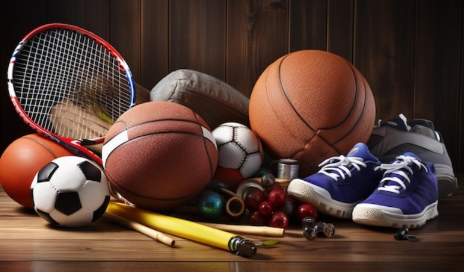
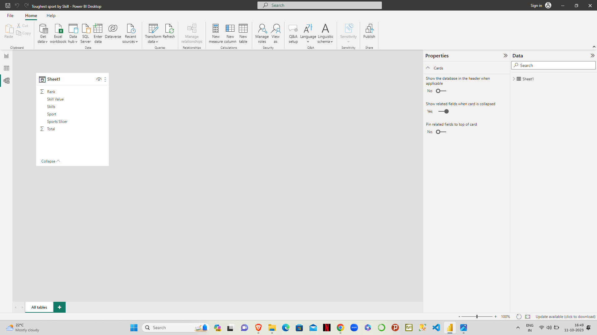
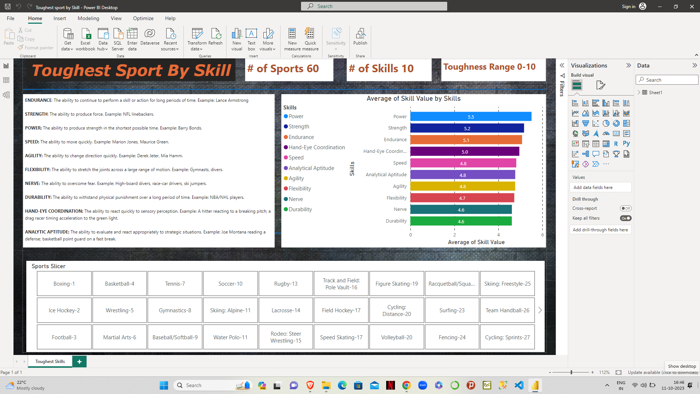

# Toughest-Sport-by-Skills-

---

## Introduction

This is a Power BI project on the data is for tough, toughest sports by skills.. Anybody can quickly come and look at the report and to see which sport require what skill highest.
**_Disclaimer_**: _All datasets and reports do not represent any company, institution or country, but just a dummy dataset to demonstrate capabilities of Power BI._ 

## Problem Statement 
1. Which sport require what skill highest?

## Skills/ concepts demonstrated
1. Unpivot Column
2. Merge Column
3. Slicers

## Modelling

There is no need of modelling in this report because it has only one table.

## Visualization

## Conclusions

1. In boxing you need nerve, and then endurance, then power, then durability.
2. For field hockey, endurance needed, then hand-eye coordination needed, then analytical aptitude is needed so players can look at it and see.
3. For different sports we need different kinds of skills. 
